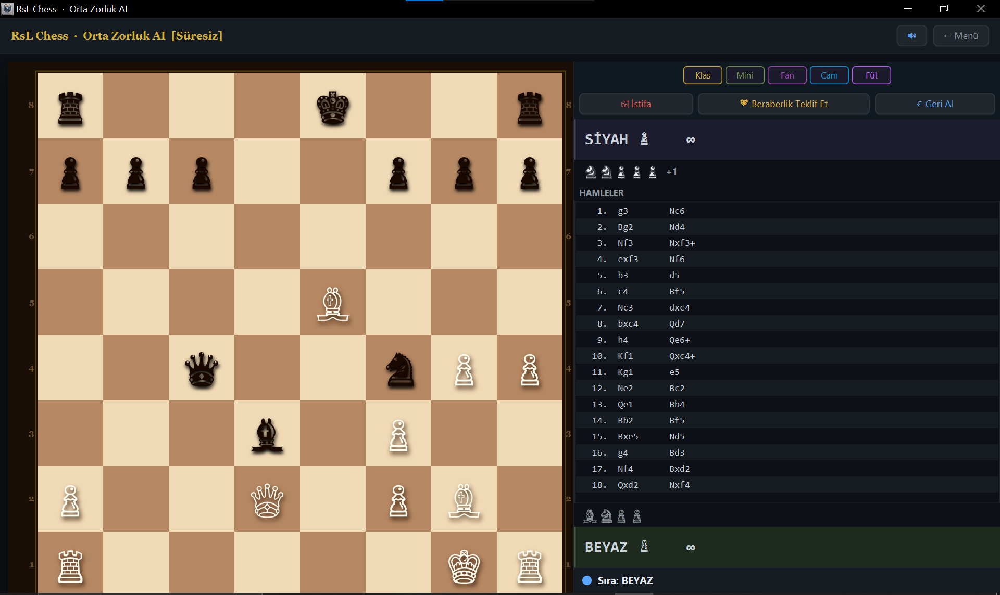

# RsL Chess

## Hakkında

JavaFX ile yazılmış, yapay zeka destekli bir satranç oyunu. Tek bilgisayarda iki oyuncu, yapay zekaya karşı üç zorluk seviyesi, ya da yerel ağ üzerinden iki oyuncu (TCP) olarak oynanabilir.




## Özellikler

- Tam kurallı satranç: rok (kısa/uzun), geçerken alma (en passant), piyon terfisi (Vezir/Kale/Fil/At seçimi), şah/mat/pat tespiti
- Tüm beraberlik kuralları: 50 hamle kuralı, üçlü tekrar, yetersiz materyal
- Yenen taşların her iki taraf için gösterimi ve maddi üstünlük (+N) göstergesi
- İstifa, karşılıklı beraberlik teklifi (yapay zekaya karşı materyal durumuna göre kabul/red) ve hamle geri alma
- Gerçek satranç notasyonu (Nf3, O-O, exd5, Qxh7# gibi) — hem hamle listesinde hem kaydedilen dosyada
- Yapay zeka artık pozisyonel değerlendirme de yapıyor (merkez kontrolü, şah güvenliği, vb.) ve mümkün olan en az hamlede mat etmeyi tercih ediyor (kaybediyorsa oyalanır)
- 3 dil desteği: Türkçe, İngilizce, Rusça (ana menüden anında değiştirilebilir)
- 3 zorluk seviyesinde yapay zeka (negamax + alpha-beta budama)
- Yerel ağ üzerinden 2 oyunculu çevrimiçi mod (sohbet, istifa ve beraberlik teklifi senkronize edilir; süre ayarını host belirler)
- Süreli oyun modları (Bullet, Blitz, Rapid) ve süresiz mod
- 5 farklı görsel tema (Klasik, Minimalist, Fantezi, Cam, Fütüristik)
- Hamle sırasında yalnızca oynanan taşın kaydığı, pürüzsüz animasyonlar
- Prosedürel olarak üretilen ses efektleri (hamle, yakalama, şah, mat)
- Her oyun sonunda `game_history/` klasörüne kaydedilen okunabilir hamle geçmişi

## İndir ve Oyna (Windows)

Java veya JavaFX kurmanıza gerek yok:

1. [Releases](https://github.com/r2246634-droid/RsL-Chess/releases/latest) sayfasından `RsL-Chess-<sürüm>-windows.zip` dosyasını indirin.
2. Zip'i bir klasöre çıkarın.
3. `RsL Chess\RsL Chess.exe` dosyasını çalıştırın.

> Windows SmartScreen "Windows bilgisayarınızı korudu" uyarısı gösterebilir (uygulama imzalı değil): **Ek bilgi → Yine de çalıştır**.

## Kaynaktan Derleme

Bağımlılık yönetimi Maven/Gradle ile değil, doğrudan `javac`/`java` ile yapılır.

### Gereksinimler

- **Windows** (başlatma betikleri `.bat`)
- **JDK** — [Eclipse Temurin](https://adoptium.net/) gibi herhangi bir JDK. Proje **JDK 25** ile test edildi; kullandığınız JDK, seçtiğiniz JavaFX sürümünün desteklediği en düşük sürümden eski olmamalı.
- **JavaFX SDK** — [openjfx.io](https://openjfx.io/) üzerinden. Proje **JavaFX 26.0.1** ile test edildi.

### Adımlar

1. JavaFX SDK'yı indirip bir klasöre çıkarın (ör. `C:\javafx-sdk-26.0.1`).
2. `JAVAFX_HOME` ortam değişkenini bu klasöre ayarlayın (bir kere yapmanız yeterli; sonra terminali yeniden açın):
   ```
   setx JAVAFX_HOME "C:\javafx-sdk-26.0.1"
   ```
3. Oyunu derleyip başlatın:
   ```
   run.bat
   ```
4. Java kurulumu gerektirmeyen Windows paketi oluşturmak isterseniz:
   ```
   package.bat
   ```
   `dist\` altında taşınabilir `RsL Chess\RsL Chess.exe` ve bunun zip'i oluşur. [WiX Toolset](https://wixtoolset.org/) kuruluysa ek olarak kurulum sihirbazı (`RsL Chess-<sürüm>.exe`) da üretilir.

Çevrimiçi mod için iki bilgisayar aynı yerel ağda olmalı; host bilgisayarda **5000 numaralı TCP portuna** güvenlik duvarında izin verilmelidir.

## Mimari Özeti

Ayrıntılı mimari notları için [`CLAUDE.md`](CLAUDE.md) dosyasına bakın.

| Paket | Sorumluluk |
|---|---|
| `com.chess.core` | Tahta, koordinat/hamle kayıtları, oyun kuralları (şah/rok/geçerken alma), zamanlayıcı |
| `com.chess.pieces` | Taş sınıfları |
| `com.chess.game` | Oyun akışı, hamle geçmişi |
| `com.chess.ai` | Yapay zeka (negamax) |
| `com.chess.i18n` | Dil desteği (TR/EN/RU) |
| `com.chess.network` | TCP tabanlı çevrimiçi oyun |
| `com.chess.sound` | Sentezlenmiş ses efektleri |
| `com.chess.theme` | Görsel temalar |
| `com.chess.ui` | JavaFX arayüzü |

## Lisans

Bu proje [MIT Lisansı](LICENSE) ile lisanslanmıştır.
